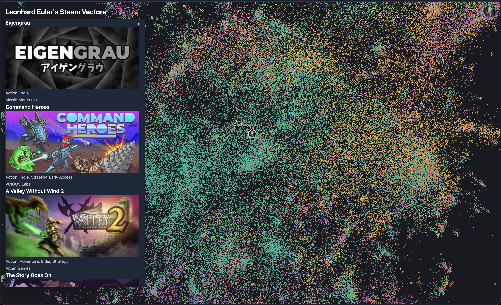

# steamvectors

Vectorized embeddings, visualization, and recommendations of Steam games

## Pipeline
- Download data from <a href="https://huggingface.co/datasets/FronkonGames/steam-games-dataset">🤗</a> -> raw_games.parquet
- Clean data, removing html & md, converting lists to strings, removing duplicates -> games.parquet
- Embed games.parquet using OpenAI *text-embedding-3-small* (512 dimensions) -> embeddings.npy
- Upload embeddings -> NeonDB + pgvector

## Backend
### Python + FastAPI
- Player *taste* embedding generated using top played games weighted by playtime and normalized
- Queries pgvector db

## Frontend
### React + Vite + Tanstack
- Allows users to login with Steam OAuth
- Visualization of vectorized data with react-three-fiber
- Shows recommended games, pathways to such, and highlights most played/searched for games

## Hosting
### TBD
